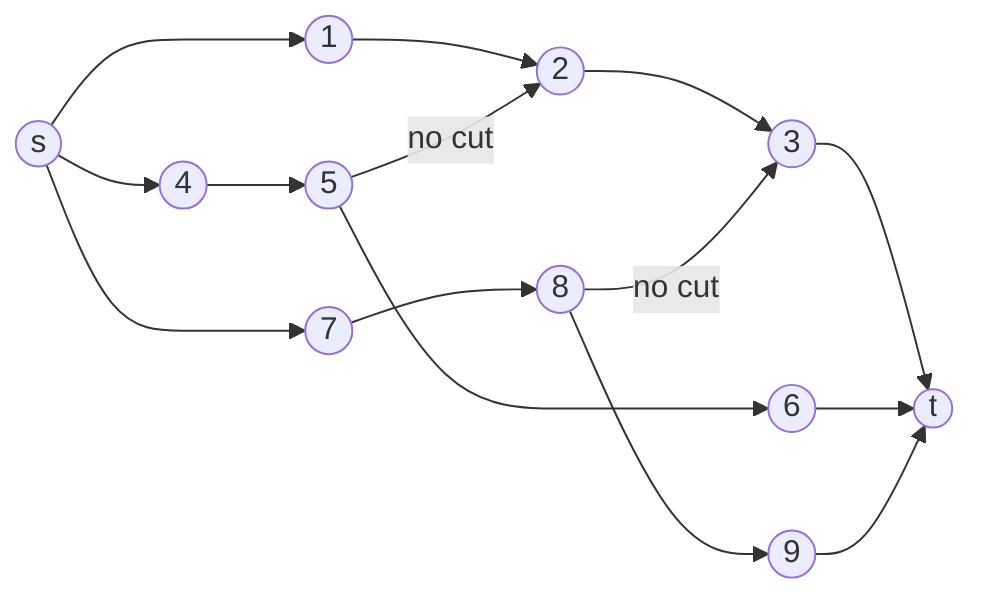

## Model 1

When we have $m$ choices for a variable, then we can build a chain from $s$ to $t$ that include the $m$ choices as edges. 

There may also be constrains on the choice of variable states. We can add edges in between to enforce these constraints.

But there may be scenarios where you have 2 chains like this:

And if we cut edges $(4,5)$, $(8,9)$, $(1, 2)$, $(2,3)$, it will still be a valid cut. However, we have chosen 2 states for the first chain $1 \rightarrow 2 \rightarrow 3$. We can eliminate this case by adding backward pointing edges of capacity / weight $+\infty$, so that the cut becomes invalid.